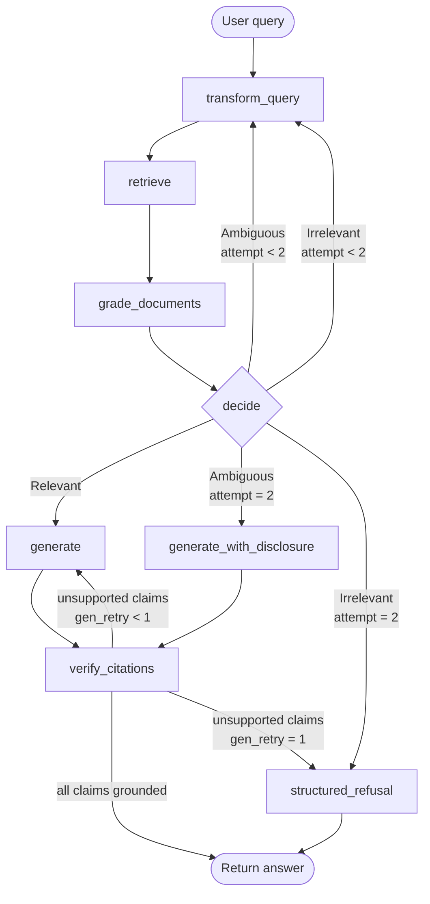

# Module 3 — Agentic RAG & Self-Healing

**Owner:** Agentic RAG Designer
**Interfaces:** consumes Module 2 retrieval API; feeds Module 4 observability + Citation Accuracy metric.
**Constraint:** TTFT ≤ 1.5 s on the happy path; zero hallucination; RBAC role propagates through every node.

> **Model ID note.** The cross-region inference profile `us.anthropic.claude-haiku-4-5-20251001-v1:0` is the **only** accepted model ID for all LLM calls (grader, generator, citation judge). The legacy on-demand model ID `anthropic.claude-haiku-4-5-20251001-v1:0` (no `us.` prefix) is **rejected** by Bedrock — using it throws `ResourceNotFoundException`. Every `boto3.client('bedrock-runtime').invoke_model` call must use the cross-region profile.

---

## 1. Query Transformation Layer

### 1.1 Routing Rule

Apply **exactly one** transform strategy per query. Do not chain transforms speculatively.

| Signal in the raw query | Strategy | Rationale |
|---|---|---|
| Exact identifier present (`ECLI:`, `art.`, `lid`, `onderdeel`) | **Direct retrieval** — no transform | BM25 exact-match handles this; transforms dilute precision |
| Conjunction of ≥ 2 distinct legal concepts (`en`, `ook`, `zowel … als`) | **Decompose** | Each sub-question needs its own grounding evidence |
| Vague / concept-only query, no identifiers, answer would look like a statute paragraph | **HyDE** | Synthesize a plausible short statute paragraph; embed it for dense retrieval |
| Narrow factual question where initial retrieval returned `Irrelevant` verdict | **Step-back** | Broaden to the governing principle before re-narrowing |
| Two or more of the above | **Decompose first** (decomposition subsumes the others; sub-questions route independently) |

**Decision defended:** Routing by a single deterministic signal keeps latency predictable. HyDE is only triggered for pure semantic queries because generating a hypothetical document for an already-identified article wastes tokens and risks recall loss.

---

### 1.2 Worked Example — Decomposition Tree

**Raw query (NL):**
> "Kan een freelance vertaler die in 2022 vanuit huis werkt zowel de thuiswerkkosten als een reiskostenvergoeding aftrekken?"

**Detection:** "zowel … als" → two distinct fiscal concepts → **Decompose**.

```
Root question
├── Q1: "Kan een freelance vertaler (IB-ondernemer) in 2022
│         thuiswerkkosten aftrekken, en zo ja, welke kosten
│         en onder welke voorwaarden?"
│    └── Retrieval scope: Wet IB 2001, art. 3.16 + 3.17;
│                         Besluit thuiswerken 2022; rlg. reiskostenvergoeding
│
└── Q2: "Kan dezelfde ondernemer in 2022 ook een
          reiskostenvergoeding voor woon-werkverkeer aftrekken,
          en is er interactie met de thuiswerkkostenregeling?"
     └── Retrieval scope: Wet IB 2001 art. 3.16 lid 2;
                          jurisprudentie woon-werkverkeer ZZP;
                          HR-arrest ECLI:NL:HR:2021:xxx
```

Each sub-query is retrieved independently (top-8 chunks each), graded independently, and their evidence sets are merged before the single generation call. If Q1 is `Relevant` and Q2 is `Irrelevant`, the generation node discloses that the reiskostenvergoeding question could not be grounded and states so explicitly in the answer.

---

### 1.3 Transform Node Pseudo-code

```python
# node: transform_query
def transform_query(state: CRAGState) -> CRAGState:
    query = state["original_query"]
    role  = state["user_role"]          # RBAC — never dropped

    # --- routing ---
    if _has_exact_identifier(query):    # regex: ECLI|art\.\s*\d|lid \d
        strategy = "direct"
        transformed = [query]
    elif _has_conjunction(query):       # regex: zowel|ook|en\b|alsmede|both
        strategy = "decompose"
        transformed = _llm_decompose(query)   # Haiku call, temp=0
    elif state["attempt_count"] > 0:    # re-entry after Irrelevant verdict
        strategy = "step_back"
        transformed = [_llm_step_back(query)] # Haiku call, temp=0
    else:
        strategy = "hyde"
        transformed = [_llm_hyde(query)]      # synthesise hypothetical paragraph

    state["retrieval_strategy"]    = strategy
    state["transformed_queries"]   = transformed
    state["transform_history"].append({"attempt": state["attempt_count"],
                                       "strategy": strategy,
                                       "queries": transformed})
    _emit_audit_span("transform_query", state)
    return state
```

---

## 2. CRAG State Machine (LangGraph)

### 2.1 Graph Diagram



**Loop guard enforcement:** `attempt_count` increments on every `TQ → RET → GRD` cycle. Hard cap = 2. `gen_retry_count` increments on every `VCN → GEN` cycle. Hard cap = 1. Combined maximum LLM-generation calls = 3 (2 retries × 1 transform path + 1 initial).

---

### 2.2 Node-by-Node Specification

#### `transform_query`
- **Input:** `original_query`, `attempt_count`, `user_role`
- **Action:** apply routing rule (§1.1); call Haiku for decompose / HyDE / step-back if needed; populate `transformed_queries` and `retrieval_strategy`.
- **RBAC:** `user_role` read, passed forward unchanged.
- **Blocks first-token?** Yes — must complete before retrieval. Target: ≤ 100 ms (Haiku call only when transform needed; regex routing is synchronous).
- **Audit span:** `transform_query` span with `strategy`, `query_count`, `attempt_count`.

#### `retrieve`
- **Input:** `transformed_queries`, `user_role`
- **Action:** for each sub-query, call Module 2 retrieval API (`retrieve(query, role, top_k=8, strategy)`). Sub-query retrievals are **concurrent** (asyncio.gather). Results merged and deduplicated by `doc_id + paragraph`.
- **RBAC:** `user_role` passed as a mandatory filter parameter to every retrieval call — OpenSearch `efficient_filter` enforces classification ceiling inside HNSW traversal.
- **Blocks first-token?** Yes — critical path. Target: ≤ 600 ms (OpenSearch + Cohere rerank, p95 per MASTER-PLAN).
- **Audit span:** `retrieve` span with `chunk_count`, `query_count`, `retrieval_strategy`.

#### `grade_documents`
- **Input:** `chunks[]`, `transformed_queries[]`, `user_role`
- **Action:** call Haiku grader once per sub-query with all relevant chunks batched in a single prompt (see §3 for verbatim prompt). Collect per-sub-query `{verdict, confidence, reason, missing_aspects}`. Compute aggregate verdict: `Relevant` if all sub-queries grade Relevant; `Ambiguous` if any is Ambiguous; `Irrelevant` if all are Irrelevant or no chunks returned.
- **Blocks first-token?** Yes — must complete before routing. Target: ≤ 300 ms (single batched Haiku call, `max_tokens=200`, `temperature=0`).
- **Audit span:** `grade_documents` span with per-sub-query `verdict`, `confidence`, `missing_aspects`.

#### `decide`
- **Input:** aggregate verdict, `attempt_count`
- **Action:** pure conditional — no LLM call, no latency.
- **Routing:** see fallback policy table (§2.4).

#### `generate`
- **Input:** `chunks[]` (grounded evidence), `transformed_queries[]`, `original_query`, `user_role`, `gen_retry_count`
- **Action:** single Haiku generation call with strict system prompt instructing the model to cite only from the provided chunks using `(doc_id, article, paragraph)` anchors.
- **RBAC:** chunks already filtered by retrieval; no cross-classification chunks can appear.
- **Blocks first-token?** Yes — streaming enabled; first token is streamed to the client as soon as Haiku starts returning tokens.
- **Audit span:** `generate` span with `gen_retry_count`, `chunk_ids_used`, `token_count`.

#### `generate_with_disclosure`
- Identical to `generate` but system prompt prepends: *"Antwoord op basis van de beschikbare bronnen. Voor de volgende deelvraag kon geen sluitend bewijs worden gevonden: {missing_aspects}. Geef aan dat dit aspect niet beantwoord kan worden op basis van de huidige documentatie."*

#### `verify_citations`
- See §3 for full specification.
- **Blocks first-token?** Runs **async post-generation**; first token is already delivered to the caller. The citation check result is appended as a metadata footer before the session is committed. If unsupported claims are found and a gen-retry is triggered, the partial streamed answer is retracted and regeneration begins.
- **Audit span:** `verify_citations` span feeds Module 4 Citation Accuracy metric directly (§3.3).

#### `structured_refusal`
- Produces a deterministic JSON response:
```json
{
  "status": "insufficient_grounding",
  "message": "Op basis van de beschikbare documentatie kan deze vraag niet worden beantwoord.",
  "closest_hits": [
    {"doc_id": "...", "title": "...", "score": 0.72, "excerpt": "..."}
  ],
  "missing_aspects": ["reiskostenvergoeding ZZP 2022"],
  "retry_suggestion": "Herformuleer de vraag of raadpleeg een fiscalist."
}
```
- Never calls a generator. Zero hallucination risk.

---

### 2.3 State Schema

```python
from __future__ import annotations
from typing import Literal, Optional
from pydantic import BaseModel, Field

class ChunkMeta(BaseModel):
    doc_id:         str
    doc_type:       str
    eli_or_ecli:    Optional[str]
    article:        Optional[str]
    paragraph:      Optional[str]
    sub:            Optional[str]
    lid:            Optional[str]
    onderdeel:      Optional[str]
    hierarchy_path: str
    effective_date: Optional[str]
    valid_from:     Optional[str]
    valid_to:       Optional[str]
    tax_year:       Optional[int]
    classification: Literal["public", "internal", "fiod"]
    parent_chunk_id:Optional[str]
    score:          float
    text:           str

class GraderVerdict(BaseModel):
    sub_query:       str
    verdict:         Literal["Relevant", "Ambiguous", "Irrelevant"]
    confidence:      float = Field(ge=0.0, le=1.0)
    reason:          str
    missing_aspects: list[str]

class CitationCheck(BaseModel):
    claims:             list[str]
    grounded:           bool
    unsupported_claims: list[str]

class CRAGState(BaseModel):
    # Identity
    trace_id:            str
    user_role:           Literal["helpdesk", "inspector", "legal", "fiod"]

    # Query lifecycle
    original_query:      str
    transformed_queries: list[str]          = Field(default_factory=list)
    retrieval_strategy:  str                = "direct"
    transform_history:   list[dict]         = Field(default_factory=list)

    # Retrieval
    chunks:              list[ChunkMeta]    = Field(default_factory=list)

    # Grading
    grades:              list[GraderVerdict]= Field(default_factory=list)
    aggregate_verdict:   Optional[Literal["Relevant", "Ambiguous", "Irrelevant"]] = None

    # Loop guards
    attempt_count:       int = 0   # transform+retrieve cycles; max 2
    gen_retry_count:     int = 0   # generation retries; max 1

    # Generation
    draft_answer:        Optional[str] = None
    citation_check:      Optional[CitationCheck] = None
    final_answer:        Optional[str] = None

    # Refusal
    refusal_payload:     Optional[dict] = None
```

`user_role` is injected at session creation from the authenticated JWT claim and **never mutated** by any node. Every Bedrock call and every OpenSearch call receives it as an explicit parameter.

---

### 2.4 Fallback Policy Table

| Grader verdict | `attempt_count` | Action | LLM calls added |
|---|---|---|---|
| `Relevant` | any | Proceed to `generate` | 0 |
| `Ambiguous` | 0 or 1 | Apply step-back rewrite → re-retrieve → re-grade | 1 (rewrite) |
| `Ambiguous` | 2 (cap hit) | `generate_with_disclosure`: answer what is grounded, explicitly note gaps | 1 (generate) |
| `Irrelevant` | 0 or 1 | Decompose or rewrite → re-retrieve (elearning corpus included in scope expansion) → re-grade | 1 (rewrite) |
| `Irrelevant` | 2 (cap hit) | `structured_refusal`: return closest hits, list missing aspects, suggest reformulation. **Never generate.** | 0 |

**Elearning scope expansion (Irrelevant path):** on the first Irrelevant re-try, the retrieval call adds `doc_type=elearning` to the filter. This handles definitional questions (e.g., "Wat is een arbeidsovereenkomst?") that fail against legislation chunks but succeed against training material. This is not a web-search fallback — all documents remain within the closed corpus (locked decision #4).

---

## 3. Retrieval Grader

### 3.1 Model Configuration

```python
GRADER_CONFIG = {
    "model_id":    "us.anthropic.claude-haiku-4-5-20251001-v1:0",  # cross-region profile
    "temperature": 0,
    "max_tokens":  200,
    "tool_choice": {"type": "any"},  # force tool-use structured output
}
```

### 3.2 Verbatim Grader Prompt Template

The grader is invoked via Bedrock tool-use so the response is guaranteed-schema JSON (no markdown wrapping, no freetext fallback).

**System prompt:**
```
You are a retrieval-quality evaluator for a Dutch tax-law RAG system.
Your task: decide whether the retrieved document chunks provide sufficient
grounding to answer the user's sub-question.

Rules:
- Base your verdict ONLY on the chunks provided. Do not use external knowledge.
- Relevant   = the chunks contain a direct, specific answer or statutory basis.
- Ambiguous  = the chunks are partially related but leave material gaps;
               answering would require inference beyond the text.
- Irrelevant = the chunks do not address the sub-question at all.
- Output confidence 0–1 (1 = certain). Below 0.6 on Relevant → downgrade to Ambiguous.
- missing_aspects: list every part of the sub-question not covered by the chunks.
  If Relevant with full coverage, return an empty list.
- Respond only via the grade_retrieval tool. No prose outside the tool call.
```

**User message template (NL + EN):**
```
## Sub-question
{sub_query}

## Retrieved chunks ({n} total)
{for each chunk:}
[CHUNK {i} | doc_id={doc_id} | art={article} | par={paragraph} | tax_year={tax_year}]
{text}
[/CHUNK]

## Task
Call grade_retrieval with your verdict.
```

**Tool definition:**
```json
{
  "name": "grade_retrieval",
  "description": "Return a structured grading verdict for the retrieved chunks.",
  "input_schema": {
    "type": "object",
    "properties": {
      "verdict": {
        "type": "string",
        "enum": ["Relevant", "Ambiguous", "Irrelevant"],
        "description": "Quality verdict for the retrieved chunks relative to the sub-question."
      },
      "confidence": {
        "type": "number",
        "minimum": 0.0,
        "maximum": 1.0,
        "description": "Grader confidence in the verdict."
      },
      "reason": {
        "type": "string",
        "description": "One-sentence justification (max 80 chars)."
      },
      "missing_aspects": {
        "type": "array",
        "items": {"type": "string"},
        "description": "Parts of the sub-question not covered by any chunk."
      }
    },
    "required": ["verdict", "confidence", "reason", "missing_aspects"]
  }
}
```

**Calibration note:** At launch, run the grader against 50 golden (query, chunk-set, expected-verdict) triples from the synthesized corpus (Module 4 golden set). If precision on `Relevant` falls below 0.92, lower the confidence threshold from 0.6 to 0.55. If false-Irrelevant rate exceeds 5%, add a positive example to the system prompt showing a Relevant case. Recalibrate after every corpus amendment batch.

---

## 4. Citation Verification Node

### 4.1 Algorithm

**Step 1 — Regex anchor extraction.** Scan `draft_answer` for all citation patterns:
```
ANCHOR_PATTERN = r'\(doc_id=(?P<doc_id>[^,]+),\s*art\.?\s*(?P<article>[^,]+),\s*(?P<paragraph>[^)]+)\)'
```
Extract a list of `(doc_id, article, paragraph)` tuples.

**Step 2 — Chunk lookup (deterministic).** For each extracted tuple, check whether a chunk in `state["chunks"]` satisfies `chunk.doc_id == doc_id AND chunk.article == article AND chunk.paragraph == paragraph`. Any tuple with no matching chunk is flagged as `unsupported`.

**Step 3 — NLI grounding judge (Haiku).** For each claim sentence that survived Step 2 (chunk exists but claim is paraphrased), call Haiku with:

```
System: You are a legal-text entailment checker.
        Answer only via the check_grounding tool.

User:
Claim: {claim_sentence}
Source text: {matched_chunk.text}

Does the source text directly entail the claim?
- entailed   = the claim is a verbatim quote or a faithful paraphrase
- not_entailed = the claim introduces facts not present in the source
```

Tool: `check_grounding` → `{"result": "entailed"|"not_entailed", "explanation": str}`

Any claim with `not_entailed` → added to `unsupported_claims`.

### 4.2 Fail-Closed Behavior

```python
def verify_citations(state: CRAGState) -> CRAGState:
    claims, unsupported = _run_anchor_check(state["draft_answer"], state["chunks"])
    unsupported += _run_nli_check(claims, state["chunks"])

    state["citation_check"] = CitationCheck(
        claims=claims,
        grounded=(len(unsupported) == 0),
        unsupported_claims=unsupported,
    )
    _emit_audit_span("verify_citations", state)  # feeds Module 4

    if unsupported:
        if state["gen_retry_count"] < 1:
            state["gen_retry_count"] += 1
            # drop unsupported claims from draft; regenerate with stricter prompt
            state["draft_answer"] = _excise_unsupported(state["draft_answer"], unsupported)
        else:
            # hard cap hit → refuse
            state["refusal_payload"] = _build_refusal(state, unsupported)
            state["final_answer"]    = None
    else:
        state["final_answer"] = state["draft_answer"]

    return state
```

**Fail-closed guarantee:** the function never returns `final_answer` when `grounded=False`. If the retry cap is also exhausted, control transfers to `structured_refusal`.

### 4.3 Module 4 Interface

The `CitationCheck` object is emitted as a Jaeger span attribute set on the `verify_citations` span:

```
span.set_attribute("citation.claims_count",      len(claims))
span.set_attribute("citation.grounded",          grounded)
span.set_attribute("citation.unsupported_count", len(unsupported_claims))
span.set_attribute("citation.unsupported_ids",   json.dumps(unsupported_claims))
```

Module 4's **Citation Accuracy** metric is computed as:
```
Citation Accuracy = (claims_count - unsupported_count) / claims_count
```
A promotion gate of `Citation Accuracy = 1.00` is enforced in CI (hard fail).

---

## 5. Loop Guard

```python
MAX_TRANSFORM_ATTEMPTS = 2   # attempt_count ceiling
MAX_GEN_RETRIES        = 1   # gen_retry_count ceiling
# Hard cap total LLM-generation calls = MAX_GEN_RETRIES + 1 = 2 per transform path
# Absolute worst case: 2 transform cycles × 1 grader + 2 generation calls = 6 Haiku calls
```

**Termination paths:**

| Condition | Terminal node |
|---|---|
| `aggregate_verdict == Relevant` | `generate` → `verify_citations` → END |
| `aggregate_verdict == Ambiguous` and `attempt_count == 2` | `generate_with_disclosure` → `verify_citations` → END |
| `aggregate_verdict == Irrelevant` and `attempt_count == 2` | `structured_refusal` → END |
| `citation_check.grounded == False` and `gen_retry_count == 1` | `structured_refusal` → END |

The `attempt_count` and `gen_retry_count` counters are written into every audit span so Module 4 can surface retry rate as a quality signal.

---

## 6. LangGraph Pseudo-code

```python
from langgraph.graph import StateGraph, END
from langgraph.checkpoint.memory import MemorySaver

# --- Build graph ---
builder = StateGraph(CRAGState)

builder.add_node("transform_query",          transform_query)
builder.add_node("retrieve",                 retrieve)
builder.add_node("grade_documents",          grade_documents)
builder.add_node("generate",                 generate)
builder.add_node("generate_with_disclosure", generate_with_disclosure)
builder.add_node("verify_citations",         verify_citations)
builder.add_node("structured_refusal",       structured_refusal)

builder.set_entry_point("transform_query")
builder.add_edge("transform_query", "retrieve")
builder.add_edge("retrieve",        "grade_documents")

def route_after_grade(state: CRAGState) -> str:
    v = state["aggregate_verdict"]
    a = state["attempt_count"]
    if v == "Relevant":
        return "generate"
    if v == "Ambiguous":
        return "transform_query" if a < MAX_TRANSFORM_ATTEMPTS else "generate_with_disclosure"
    # Irrelevant
    if a < MAX_TRANSFORM_ATTEMPTS:
        state["attempt_count"] += 1
        return "transform_query"
    return "structured_refusal"

builder.add_conditional_edges("grade_documents", route_after_grade, {
    "generate":                 "generate",
    "generate_with_disclosure": "generate_with_disclosure",
    "transform_query":          "transform_query",
    "structured_refusal":       "structured_refusal",
})

def route_after_verify(state: CRAGState) -> str:
    if state["citation_check"].grounded:
        return END
    if state["gen_retry_count"] <= MAX_GEN_RETRIES:
        return "generate"
    return "structured_refusal"

builder.add_conditional_edges("verify_citations", route_after_verify, {
    END:                "END",
    "generate":         "generate",
    "structured_refusal":"structured_refusal",
})

builder.add_edge("generate",                 "verify_citations")
builder.add_edge("generate_with_disclosure", "verify_citations")
builder.add_edge("structured_refusal",       END)

graph = builder.compile(checkpointer=MemorySaver())
```

---

## 7. Per-Node Latency Budget

Happy path: `transform_query` (skip) → `retrieve` → `grade_documents` → `generate` → `verify_citations (async)` → first token delivered.

| Node | Blocks first-token? | Budget (p95) | Notes |
|---|---|---|---|
| `transform_query` (direct route) | Yes | 5 ms | Regex only; no LLM call |
| `transform_query` (decompose/HyDE) | Yes | 100 ms | Single Haiku call, `max_tokens=400` |
| `retrieve` (concurrent sub-queries) | Yes | 600 ms | OpenSearch BM25+kNN + Cohere rerank; sub-queries in parallel |
| `grade_documents` | Yes | 300 ms | Single batched Haiku call, `max_tokens=200` |
| `decide` | Yes | < 1 ms | Pure Python conditional |
| `generate` (streaming) | Yes — first token | 400 ms to first token | Streaming; caller receives tokens as they arrive |
| `verify_citations` | No — async | 200 ms | Runs concurrently with token streaming; result appended as footer |
| **Happy-path total to first token** | | **≤ 1 306 ms** | Headroom: 194 ms against 1 500 ms budget |

**Streaming note:** `generate` uses `invoke_model_with_response_stream` on Bedrock. The `verify_citations` check runs in a background task; if it finds unsupported claims, the stream is marked as `[RETRACTED]` in the session log and regeneration begins (retraction latency is acceptable because it is outside the first-token window).

---

## 8. Audit-Event Emission (Module 4 Observability)

Every node emits a single OpenTelemetry span. The following attributes are **mandatory** on every span; Module 4 reads them from Jaeger to populate its observability dashboard.

```python
def _emit_audit_span(node_name: str, state: CRAGState, extra: dict = {}) -> None:
    with tracer.start_as_current_span(node_name) as span:
        span.set_attribute("trace_id",      state["trace_id"])
        span.set_attribute("node_name",     node_name)
        span.set_attribute("user_role",     state["user_role"])          # RBAC audit
        span.set_attribute("attempt_count", state["attempt_count"])
        span.set_attribute("gen_retry_count", state["gen_retry_count"])
        span.set_attribute("retrieval_strategy", state["retrieval_strategy"])
        span.set_attribute("latency_ms",    _elapsed_ms())
        if state.get("aggregate_verdict"):
            span.set_attribute("verdict", state["aggregate_verdict"])
        for k, v in extra.items():
            span.set_attribute(k, v)
```

**Span attributes by node:**

| Node | Additional span attributes |
|---|---|
| `transform_query` | `strategy`, `sub_query_count`, `transform_history_len` |
| `retrieve` | `chunk_count`, `dedup_count`, `query_count` |
| `grade_documents` | `verdict` (per sub-query JSON), `min_confidence`, `missing_aspects_count` |
| `generate` | `token_count_in`, `token_count_out`, `bedrock_model_id` |
| `verify_citations` | `claims_count`, `grounded`, `unsupported_count` (→ Citation Accuracy) |
| `structured_refusal` | `refusal_reason`, `closest_hit_scores` |

The `user_role` attribute on every span enables Module 4 to produce per-role quality dashboards and detect RBAC anomalies (e.g., a helpdesk user query that somehow retrieved `fiod`-classified chunks — which should be structurally impossible but is detectable post-hoc).

---

## 9. Interface Summary

**From Module 2 (inputs):**
- `retrieve(query: str, role: str, top_k: int, strategy: str, doc_type_filter: list[str] | None) → list[ChunkMeta]`
- Chunk shape includes all fields in `ChunkMeta` above; `score` is the post-rerank Cohere relevance score.

**To Module 4 (outputs):**
- Jaeger spans with mandatory attribute set (§8) — consumed by observability dashboard.
- `CitationCheck.unsupported_claims` list — consumed by Citation Accuracy metric (promotion gate: = 1.00).
- `GraderVerdict[]` per query — consumed by retrieval-quality trend dashboard.
- `attempt_count` and `gen_retry_count` — consumed by self-healing rate metric.

---

## Domain Review Findings

### Citation Format (Check 1)

- `ChunkMeta` in Section 2.3 carries `eli_or_ecli` as a single optional string, mirroring the Module 1-2 single-field issue. The citation anchor regex in Section 4.1 (`ANCHOR_PATTERN`) extracts `(doc_id, article, paragraph)` — it does not extract the ELI or ECLI string. This means a generated citation of the form `(ECLI:NL:HR:2021:1234, overwegingen)` cannot be verified against `eli_or_ecli` by the current regex; it would require a separate ELI/ECLI-aware pattern. If Module 1-2 splits the field into `eli` and `ecli`, `ChunkMeta` must be updated accordingly and `ANCHOR_PATTERN` must be extended to capture ECLI citations in the generated text.

### Hierarchy Depth (Check 2)

- The grader prompt template (Section 3.2) displays chunk metadata as `art={article} | par={paragraph} | tax_year={tax_year}`. The `lid`, `onderdeel`, and `sub` fields from `ChunkMeta` are not surfaced in the grader prompt. A grader evaluating whether a chunk on `Artikel 3.114 lid 2 onderdeel a` answers a question about `lid 3 onderdeel b` of the same article cannot detect the mismatch because both chunks share the same `article` value and the grader sees only `art=3.114`. Flag: add `lid={lid} | onderdeel={onderdeel}` to the per-chunk header line in the grader user-message template (Section 3.2).
- The citation anchor regex in Section 4.1 captures `(doc_id, article, paragraph)` but not `lid` or `onderdeel`. A citation that is correct at the article level but wrong at the lid/onderdeel level will pass Step 2 of the verifier. For Dutch fiscal law where material obligations differ between leden, this is a hallucination risk. Flag: extend `ANCHOR_PATTERN` and the Step 2 lookup to include `lid` and `onderdeel` fields.

### Temporal Validity (Check 3)

- The grader prompt (Section 3.2) passes `tax_year` in the per-chunk header. This is correct and enables the grader to detect year mismatches in the evidence. The `CRAGState` does not carry the user's requested tax year as a separate field — it is inferred from the query string by Module 4's cache-key extractor. If the query does not contain an explicit year (e.g., "What are the deduction limits for home office expenses?"), `tax_year` in the retrieved chunks may span multiple years and the grader receives no anchor to prefer the current-year chunk. Flag: add `requested_tax_year: Optional[int]` to `CRAGState`, populated at session creation from query parsing or user-supplied context, and pass it in the grader prompt so the grader can prefer year-matching chunks.

### Superseded / Consolidated Versions (Check 4)

- `ChunkMeta` carries `valid_from`, `valid_to`, and `tax_year` but not `superseded_by`. If a retrieved chunk is superseded (non-null `superseded_by` in OpenSearch), the generation node has no signal to disclose this to the user. The generate node's system prompt (described in Section 2.2 under `generate`) instructs citation using `(doc_id, article, paragraph)` anchors but does not instruct the LLM to warn when a source has been superseded. Flag: add `superseded_by: Optional[str]` to `ChunkMeta` (propagated from Module 1-2 retrieval response) and add a system-prompt instruction: "If any cited chunk has a non-null `superseded_by` value, prepend a disclosure: 'Let op: dit artikel is vervangen door [superseded_by] en was geldig tot [valid_to].'"

### FIOD Classification (Check 5)

- `CRAGState.user_role` is typed as `Literal["helpdesk", "inspector", "legal", "fiod"]` (Section 2.3). The FIOD role is present as a first-class value and is propagated through every node. The audit span (Section 8) emits `user_role` on every span, enabling post-hoc anomaly detection. This is correctly handled.
- The `structured_refusal` response (Section 2.2) returns `closest_hits` including `doc_id`, `title`, `score`, and `excerpt`. If a helpdesk user triggers `structured_refusal` on a query whose closest hits are FIOD chunks, the `closest_hits` list must be filtered to the user's allowed classification before inclusion in the refusal payload. The current pseudo-code in Section 2.2 does not show this filter applied to `closest_hits`. This is a potential FIOD existence-disclosure: revealing that the closest match is a FIOD document (even without its content) tells the user that a classified dossier on this topic exists. Flag as critical gap: apply the same `redaction_guard` logic to `_build_refusal`'s candidate list before serialising `closest_hits`.

### Multilinguality (Check 6)

- The grader system prompt (Section 3.2) is written in English despite the system serving Dutch-primary content. The grader LLM (Haiku 4.5) is multilingual and will handle Dutch chunks correctly, but the instruction language mismatch may subtly anchor the grader's reasoning in English legal framing. Not a blocking issue, but flag: consider providing the grader prompt in Dutch or bilingual form to reduce any systematic bias when evaluating NL statutory text versus EN EU-directive text.

### Legal Counsel Role (Check 7)

- `CRAGState.user_role` includes `"legal"` as a distinct role (Section 2.3). However, the routing rules (Section 1.1) and all node specifications treat `legal` identically to `inspector` — both get `["public","internal"]` classification access with no differentiation. There is no role-specific retrieval behaviour (e.g., preferring `doc_type=case_law` for legal counsel, or surfacing privileged memo subcategories). This is an omission rather than an error, but it means the `legal` role distinction has no operational effect in Module 3 today. Flag: define at minimum one legal-counsel-specific retrieval hint (e.g., default `doc_type_filter=["case_law","policy"]` when `user_role=="legal"`) to justify the role's existence in the state schema.

### Cache Poisoning / Tax-Year Ambiguity (Check 8)

- The CRAG state machine does not interact with the semantic cache directly — caching is Module 4's responsibility. Module 3's contribution is the `tax_year` field on `ChunkMeta`, which flows into Module 4's cache key construction. No gap in Module 3 for this check.
