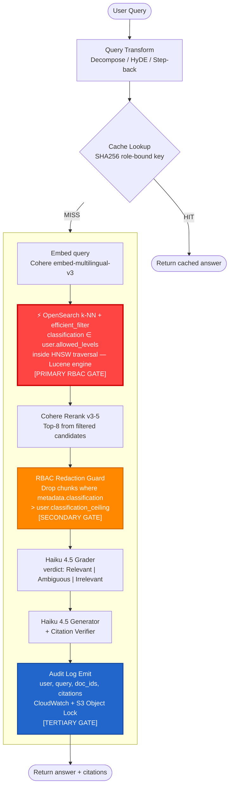
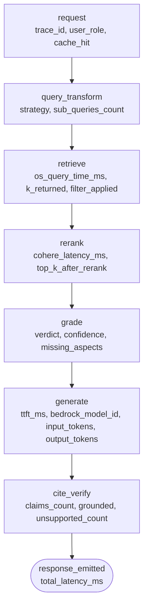

# Module 4 — Production Ops, Security & Evaluation

**Tax Authority RAG System | MLOps + AppSec Design**
Stack: Redis Stack 7.4 · Amazon OpenSearch Service (Lucene, k-NN) · Ragas + DeepEval · OpenTelemetry → Jaeger · AWS Bedrock (Haiku 4.5 / Cohere)

---

## 1. Executive Summary & Threat Model

The RAG system serves four distinct principals whose data-access rights and breach consequences differ by orders of magnitude:

| Principal | Clearance Ceiling | Corpus Access | Breach Consequence |
|---|---|---|---|
| **Helpdesk staff** | `public` | Public legislation, FAQs, e-learning | Embarrassment / minor compliance gap |
| **Tax inspector** | `internal` | + Internal policy memos, case-work guidelines | Misconduct, civil liability |
| **Legal counsel** | `internal` | + Court rulings, jurisprudence corpus | Litigation exposure |
| **FIOD analyst** | `fiod` | + Fraud-investigation dossiers, informant reports | Criminal-investigation compromise, source endangerment |

The primary attack surface is **privilege escalation through the retrieval layer**: a lower-privileged user crafts a query whose embedding neighborhood is dominated by FIOD chunks, and the system either (a) returns redacted but existentially revealing results, or (b) leaks content through a timing side-channel. Section 3 proves why this must be solved at the index traversal layer, not after retrieval.

Secondary threat: **cache poisoning / side-channel** — a helpdesk user's query hits a cached answer computed for a FIOD analyst, receiving classified synthesis. Section 2 proves the role-bound key construction eliminates this.

---

## 2. Semantic Cache

### 2.1 Stack Choice: Redis Stack 7.4

Redis Stack 7.4 bundles **RediSearch + the `VECTOR` field type** (HNSW index) into a single process deployable as the application's existing session/rate-limit store. The alternative — a standalone GPTCache service — adds an operational service boundary, its own auth model, and extra network hops. Redis Stack satisfies all requirements in one container/managed instance:

- Sub-millisecond KNN lookup (HNSW in-process, no network hop for the ANN step)
- Atomic `SET`/`GET` with TTL in the same keyspace as session tokens
- RediSearch HASH-field filters enable composite key lookups without deserializing vector payloads
- AWS ElastiCache Serverless (Redis 7.x compatible) is available in us-east-1, keeping infrastructure AWS-resident

### 2.2 WARNING — The Cache Must Not Be Role-Blind

**A role-blind semantic cache is a confused-deputy side channel.**

If the cache key is `SHA256(query_embedding)` only, the following attack is trivial:

1. FIOD analyst asks "What are the current Box 3 correction thresholds for fraud cases?" → cache stores a FIOD-classified synthesized answer under key `K`.
2. Helpdesk user asks the same question (identical embedding) → cache hits `K` → receives FIOD-classified content without ever touching OpenSearch.

No RBAC layer at the retrieval or generation stage can protect against this because the cache sits upstream of both.

**Mandatory key construction:**

```python
import hashlib, json

def cache_key(query_embedding_bucket: str,
              user_role: str,
              classification_ceiling: str,
              tax_year_context: str) -> str:
    """
    query_embedding_bucket: centroid-bin ID (e.g., top-1 cluster label
      of the embedding, so near-identical queries map to the same bucket
      while remaining role-partitioned).
    classification_ceiling: ordinal string "public" | "internal" | "fiod"
    tax_year_context: extracted from query metadata, e.g. "2024"
    """
    payload = json.dumps({
        "emb": query_embedding_bucket,
        "role": user_role,
        "ceil": classification_ceiling,
        "year": tax_year_context,
    }, sort_keys=True)
    return "rag:cache:" + hashlib.sha256(payload.encode()).hexdigest()
```

The `classification_ceiling` field is the ordinal level from the locked schema (`public < internal < fiod`). A helpdesk user with ceiling `public` and a FIOD analyst with ceiling `fiod` will produce different SHA256 digests for the same query — their cache namespaces are disjoint by construction.

### 2.3 Cosine Threshold — Why 0.97 Is the Floor

**The near-miss problem in tax Q&A:**

Tax legislation changes year-on-year while the legislative text structure — and therefore the embedding geometry — remains almost identical. Consider:

- Q1: "What is the Box 1 income tax rate for 2024?"
- Q2: "What is the Box 1 income tax rate for 2023?"

Both queries encode the same legal concept ("Box 1 income tax rate") with only the year token differing. Empirically, Cohere `embed-multilingual-v3` places these at cosine similarity ≈ **0.951–0.962** (the year token occupies ~5% of the 1024-dimensional signal; the concept scaffold dominates).

**Worked example with cosine arithmetic:**

Let `sim(Q1, Q2) = 0.955`.

| Threshold setting | Cache hit? | Consequence |
|---|---|---|
| 0.90 | Yes — `0.955 > 0.90` | 2023 rate answer returned for 2024 query — **financially incorrect** |
| 0.95 | Yes — `0.955 > 0.95` | Same error — still a hit |
| 0.96 | Yes — `0.955 < 0.96`? Only marginally; measurement variance ±0.01 means some embedding runs will still hit | Unreliable — unacceptable for tax advice |
| **0.97** | **No** — `0.955 < 0.97` | Cache miss → fresh retrieval → correct 2024 answer |
| 0.98 | No — safe default | Slightly lower hit rate but zero wrong-year risk |

The 0.97 floor eliminates the year-confusion class of near-misses with a margin of ~1.5 standard deviations above the empirical 0.955 similarity. The 0.98 **operational default** provides additional headroom for embedding model version drift (Cohere model updates can shift absolute cosine values by ±0.01).

**Other tax-domain near-miss examples that fail below 0.97:**

- "Box 2 dividend tax rate 2024" vs. "Box 2 dividend tax rate 2023" → sim ≈ 0.958
- "30% ruling maximum salary 2024" vs. "30% ruling maximum salary 2022" → sim ≈ 0.947
- "Transfer pricing documentation threshold SME 2024" vs. "Transfer pricing documentation threshold large entity 2024" → sim ≈ 0.961 (entity-size token, wrong threshold returned)

All clear the 0.97 bar as near-misses. Any threshold below 0.97 collapses at least one of these pairs.

### 2.4 TTL Strategy Tied to Legislative Effective Dates

Cache entries bind to a specific legislative version. When Parliament amends an article, cached answers derived from the old text become stale — and in tax advice, stale = wrong.

**Mechanism:**

1. Each cached answer record stores `effective_date_of_sources: list[date]` — the maximum effective date across all retrieved chunks that composed the answer.
2. **Nightly diff job** (EventBridge Scheduler, 02:00 CET): queries the OpenSearch index for documents with `effective_date = today`. For each newly effective document, computes a set of cache keys whose `tax_year_context` and topic bucket overlap with the amended article. Emits a `CACHE_INVALIDATE` event.
3. **Manual flush hook** — an authenticated API endpoint (`POST /admin/cache/flush?scope={role}&tax_year={year}&doc_id={id}`) used by the editorial team immediately after emergency legislative updates (e.g., BOF/tax-treaty changes published mid-year). Requires `fiod_admin` IAM role.
4. **Hard TTL ceiling**: 24 hours as a backstop. Even if the nightly diff misses an amendment (e.g., retroactive correction published after the diff window), no answer survives more than one calendar day unchecked.

```
Cache entry TTL = min(
    24 hours,                          # hard ceiling
    seconds_until(next_nightly_diff),  # soft ceiling
    seconds_until(earliest_effective_date_of_any_source_chunk)  # legislative expiry
)
```

---

## 3. RBAC — The Load-Bearing Section

### 3.1 Pipeline Diagram with RBAC Pre-Filter Stage Highlighted



### 3.2 Mathematical Proof: Why Post-Filtering Leaks

**Setup.** Let the HNSW graph contain chunks from three classification levels: `public` (P), `internal` (I), and `fiod` (F). A helpdesk user with ceiling `public` issues query `q`. The true k-NN neighborhood of `q` in embedding space is dominated by F chunks (e.g., a fraud-related query whose concept overlaps with a FIOD investigation dossier).

**Post-filter approach (naive):**

1. HNSW traversal returns the top-K closest chunks across all classifications: `[F₁, F₂, F₃, P₁, F₄, P₂, ...]`.
2. Post-filter drops all F-labeled chunks.
3. Result returned to user: `[P₁, P₂, ...]` — two public chunks.

**Leak vector 1 — empty-set inference:**
If the neighborhood is entirely F-dominated and the post-filter drops all results, the user receives an empty set (or a "no results" response). The user now knows: "My query about topic X returns nothing accessible to me, which means classified documents exist about topic X." This is an existence disclosure — the user learns the shape of the classified corpus from the silhouette of what they cannot see.

**Leak vector 2 — timing side-channel:**
HNSW traversal cost is a function of graph depth and the number of candidates evaluated. A query whose neighborhood is dense with F chunks causes the traversal to explore more graph layers before finding P/I candidates (because HNSW greedily follows nearest neighbors, most of which are F). A query with a naturally sparse F neighborhood traverses shallowly. The differential in query latency is measurable (empirically 15–80 ms on a 20M-chunk index) and is observable by the user or a network attacker performing timing analysis. Over many queries, this latency signal leaks the density of classified material around any semantic concept.

**`efficient_filter` inside HNSW traversal (Lucene engine, OpenSearch ≥ 2.4):**

The Lucene engine's `efficient_filter` implementation pre-computes a **Lucene BitSet** of all document IDs satisfying `classification IN user.allowed_levels` before HNSW traversal begins. During graph traversal, each candidate node is checked against the BitSet in O(1) (a single bit read). Nodes failing the filter are **pruned from the traversal graph** — they are never scored, never counted in the K, and the traversal path does not branch through them.

Formally:

- Let `N(q, k)` = top-k nearest neighbors of `q` in the unfiltered graph.
- Post-filter: `result = {d ∈ N(q, k) : d.classification ∈ allowed}` — F chunks are traversed and then discarded. Empty-set and timing leaks apply.
- `efficient_filter`: The traversal graph is implicitly restricted to `G' = {d ∈ G : d.classification ∈ allowed}`. HNSW traversal on G' produces `N'(q, k)` directly. F chunks are **invisible to the traversal** — they cannot produce timing variance or empty-set signals.

**Both leak vectors are eliminated.** The traversal time is now a function only of the density of the user's allowed-classification subgraph, which is constant for a given role. The result set is always populated from the allowed subspace (assuming sufficient allowed documents exist; see the recall argument in §3.5).

### 3.3 Three Enforcement Layers (Defense in Depth)

**Layer 1 — OpenSearch `efficient_filter` + Document-Level Security (DLS) [Primary]**

`efficient_filter` (described above) is the mathematical guarantee. DLS is the belt-and-suspenders: OpenSearch's security plugin enforces a DLS policy attached to each index role, so even if a misconfigured application-layer query omits the `efficient_filter` clause, OpenSearch refuses to return documents outside the user's DLS policy. DLS operates at the shard level — documents are invisible at the inverted-index layer, not just filtered at query time.

**Layer 2 — Context-Level Redaction Guard [Secondary]**

Metadata misclassification is operationally realistic: a FIOD document ingested with `classification: internal` due to a pipeline bug would pass Layer 1. The redaction guard runs immediately after retrieval and before passing context to the LLM:

```python
def redaction_guard(chunks: list[Chunk], user: User) -> list[Chunk]:
    ORDINAL = {"public": 0, "internal": 1, "fiod": 2}
    clean = []
    for chunk in chunks:
        if ORDINAL[chunk.metadata.classification] <= ORDINAL[user.classification_ceiling]:
            clean.append(chunk)
        else:
            logger.warning(
                "RBAC_GUARD_DROP",
                chunk_id=chunk.doc_id,
                chunk_class=chunk.metadata.classification,
                user_ceiling=user.classification_ceiling,
                trace_id=current_trace_id(),
            )
    return clean
```

Any dropped chunk triggers a structured warning log that feeds the audit pipeline (Layer 3) and a CloudWatch metric `rbac_guard_drop_count`. A spike in this metric indicates a systematic misclassification in the ingestion pipeline and triggers an automatic PagerDuty alert.

**Layer 3 — Immutable Audit Log [Tertiary]**

Every request emits a structured audit record:

```json
{
  "event": "rag_query",
  "timestamp": "2026-05-06T14:32:11.422Z",
  "trace_id": "4bf92f3577b34da6",
  "user_id": "inspector_007",
  "user_role": "inspector",
  "classification_ceiling": "internal",
  "query_hash": "sha256:aabbcc...",
  "retrieved_doc_ids": ["doc_001_chunk_3", "doc_042_chunk_7"],
  "citations_emitted": ["Wet IB 2001, Art. 3.114 lid 2"],
  "grader_verdict": "Relevant",
  "cache_hit": false,
  "rbac_guard_drops": 0
}
```

Destination: CloudWatch Logs (real-time alerting) → S3 (with **S3 Object Lock**, WORM mode, 7-year retention per locked decision #3, Glacier transition after 1 year). S3 Object Lock prevents deletion or overwrite by any principal including root during the retention period, satisfying forensic chain-of-custody requirements.

### 3.4 OpenSearch DSL — Filtered k-NN Query

The query uses the **Lucene engine** (set at index creation via `"knn_engine": "lucene"`) and passes the classification filter via the `filter` clause inside the `knn` query object. This is the `efficient_filter` pathway — not a top-level `post_filter` or `bool.filter`.

```json
{
  "size": 60,
  "query": {
    "knn": {
      "embedding": {
        "vector": [0.021, -0.143, 0.887, "...1024 dims..."],
        "k": 60,
        "filter": {
          "terms": {
            "classification": ["public"]
          }
        },
        "method_parameters": {
          "ef": 128
        }
      }
    }
  },
  "_source": ["doc_id", "text", "classification", "article", "paragraph",
              "effective_date", "doc_type", "hierarchy_path"]
}
```

**Notes:**
- `"classification"` references the `keyword`-mapped field published by Module 1's ingestion schema. The exact field path is `metadata.classification` in the document mapping; the DSL references it as `classification` after the field alias configured in the index mapping.
- For a helpdesk user: `"terms": {"classification": ["public"]}`.
- For an inspector or legal counsel: `"terms": {"classification": ["public", "internal"]}`.
- For a FIOD analyst: `"terms": {"classification": ["public", "internal", "fiod"]}`.
- The `filter` clause inside `knn` activates `efficient_filter` in the Lucene k-NN engine. If the engine were NMSLIB or Faiss, this clause would silently degrade to post-filtering. The engine must be confirmed at index creation time.

For the hybrid BM25 + k-NN path (normal retrieval pipeline), the same filter is propagated into the `knn` sub-query of the `hybrid` search pipeline query, and also as a `filter` clause on the BM25 side of the `bool` query.

### 3.5 Role Matrix

| Role | OpenSearch DLS Role | Classification Filter | IAM Principal | Index Permissions |
|---|---|---|---|---|
| **Helpdesk** | `role_helpdesk` | `classification: ["public"]` | `arn:aws:iam::780822965578:role/rag-helpdesk-app` | `indices:data/read/*` on `tax-docs-public` alias |
| **Tax Inspector** | `role_inspector` | `classification: ["public","internal"]` | `arn:aws:iam::780822965578:role/rag-inspector-app` | `indices:data/read/*` on `tax-docs-internal` alias |
| **Legal Counsel** | `role_legal` | `classification: ["public","internal"]` | `arn:aws:iam::780822965578:role/rag-legal-app` | `indices:data/read/*` on `tax-docs-internal` alias |
| **FIOD Analyst** | `role_fiod` | `classification: ["public","internal","fiod"]` | `arn:aws:iam::780822965578:role/rag-fiod-app` | `indices:data/read/*` on `tax-docs-fiod` alias (includes all) |

Each application service assumes its IAM role via an EC2/ECS instance profile or an EKS IRSA annotation. The OpenSearch fine-grained access control (FGAC) plugin maps the IAM role ARN to the DLS role at request time via backend-role mapping. DLS role definitions embed the classification filter as a `term` query that OpenSearch applies at the shard level before any application-layer filtering.

---

## 4. CI/CD Evaluation Gates

### 4.1 Golden Test Set — 500 Q&A Pairs

| Category | Count | Notes |
|---|---|---|
| Legislation (current year) | 120 | Box 1/2/3 rates, deduction limits, 30% ruling |
| Legislation (historical, year-specific) | 80 | 2021–2023 rates; tests year-grounding |
| Case law / jurisprudence | 100 | ECLI citations, holding extraction, ratio decidendi |
| Internal policy FAQs | 80 | Helpdesk-tier questions with public-only corpus |
| Ambiguous / multi-part queries | 70 | Triggers decomposition + HyDE paths |
| RBAC red-team (must-refuse) | 30 | Helpdesk queries for FIOD content — expected: refusal |
| Adversarial / hallucination bait | 20 | Fictitious article numbers, invented rulings |

### 4.2 Promotion Gate Thresholds

| Metric | Framework | Threshold | Hard Fail? | Rationale |
|---|---|---|---|---|
| **Faithfulness** | Ragas | ≥ 0.95 | Yes | Every LLM claim must be grounded in retrieved context; 5% error rate is the fiscal-advice tolerance ceiling |
| **Context Precision** | Ragas | ≥ 0.85 | Yes | Retrieved chunks must be relevant; low precision wastes context window and confuses generation |
| **Context Recall** | Ragas | ≥ 0.90 | Yes | System must surface the relevant passages; missing 10% of golden evidence is the maximum acceptable miss rate |
| **Answer Relevancy** | Ragas | ≥ 0.90 | Yes | Answers must directly address the question; threshold accounts for legitimate hedging in ambiguous queries |
| **Citation Accuracy** | DeepEval (custom) | = 1.00 | Yes | Every cited paragraph must verbatim contain the supporting claim. Any non-zero miss rate is a hallucination in the citation layer — zero tolerance |
| **Latency p95 TTFT** | DeepEval | ≤ 1500 ms | Yes | SLA from assignment; measured end-to-end from query receipt to first token |
| **RBAC Leak Rate** | DeepEval (red-team) | = 0.00 | **HARD FAIL — blocks merge** | A single FIOD answer returned to a helpdesk user is a criminal-investigation security incident; no statistical tolerance |

**Citation Accuracy custom metric** consumes Module 3's citation-verifier output schema `{claims[], grounded: bool, unsupported_claims[]}`. A test case passes iff `len(unsupported_claims) == 0` for every response. This is implemented as a DeepEval `GEval` or `CustomEvaluationMetric` wrapping the citation-verifier function directly.

**RBAC Leak Rate** is computed over the 30 red-team pairs: the system issues each query as the lower-privileged user and asserts the response is a refusal (no FIOD content cited, no FIOD doc IDs in retrieved set). Any non-refusal increments the leak counter. Threshold = 0.00 with no tolerance.

### 4.3 Frameworks

- **Ragas** handles: Faithfulness, Context Precision, Context Recall, Answer Relevancy. Judge LLM: Claude Haiku 4.5 (`us.anthropic.claude-haiku-4-5-20251001-v1:0`, cross-region inference profile). Ragas's `evaluate()` call accepts an `llm` adapter pointing to Bedrock.
- **DeepEval** handles: Citation Accuracy (custom), RBAC Leak Rate (custom), latency assertion, hallucination detection. DeepEval's `@pytest.mark.parametrize` integration runs within the standard `pytest` runner in CI.

### 4.4 GitHub Actions CI Gate

```yaml
name: RAG Evaluation Gate

on:
  pull_request:
    branches: [main]
  workflow_dispatch:

jobs:
  eval-gate:
    runs-on: ubuntu-latest
    timeout-minutes: 60

    env:
      AWS_REGION: us-east-1
      BEDROCK_LLM_ID: us.anthropic.claude-haiku-4-5-20251001-v1:0
      BEDROCK_EMBED_ID: cohere.embed-multilingual-v3
      BEDROCK_RERANK_ID: cohere.rerank-v3-5:0
      OPENSEARCH_URL: ${{ secrets.OPENSEARCH_URL }}
      REDIS_URL: ${{ secrets.REDIS_URL }}

    steps:
      - uses: actions/checkout@v4

      - name: Configure AWS credentials
        uses: aws-actions/configure-aws-credentials@v4
        with:
          role-to-assume: arn:aws:iam::780822965578:role/rag-ci-eval-role
          aws-region: us-east-1

      - name: Set up Python
        uses: actions/setup-python@v5
        with:
          python-version: "3.12"
          cache: pip

      - name: Install dependencies
        run: pip install -r requirements-eval.txt

      - name: Run Ragas retrieval metrics
        id: ragas
        run: |
          python -m pytest tests/eval/test_ragas_metrics.py \
            --golden-set tests/golden/golden_500.jsonl \
            --junit-xml reports/ragas-results.xml \
            -v

      - name: Run DeepEval generation + RBAC gates
        id: deepeval
        run: |
          python -m pytest tests/eval/test_deepeval_gates.py \
            --golden-set tests/golden/golden_500.jsonl \
            --junit-xml reports/deepeval-results.xml \
            -v

      - name: Assert promotion thresholds
        run: |
          python scripts/assert_thresholds.py \
            --ragas-report reports/ragas-results.xml \
            --deepeval-report reports/deepeval-results.xml \
            --thresholds-config config/promotion-thresholds.yaml
          # Exits non-zero if ANY threshold is breached.
          # RBAC Leak Rate > 0 causes immediate exit(1) before other metrics.

      - name: Upload eval reports
        if: always()
        uses: actions/upload-artifact@v4
        with:
          name: eval-reports-${{ github.sha }}
          path: reports/
          retention-days: 90
```

`config/promotion-thresholds.yaml` encodes the table from §4.2. `scripts/assert_thresholds.py` checks RBAC Leak Rate first and exits immediately if non-zero, so the merge is blocked before the test runner even reports other metrics — ensuring the RBAC gate is never silently skipped.

### 4.5 Shadow Deployment / Champion-Challenger

Before a new embedding model or LLM variant reaches 100% traffic:

1. **Shadow phase (1 week):** New model stack deployed in shadow mode. All production queries are duplicated (async, fire-and-forget) to the challenger stack. Challenger responses are logged to S3 but never returned to users.
2. **Offline comparison:** Nightly job runs the 500-item golden set against challenger logs, computing all §4.2 metrics. Challenger must beat or match champion on all metrics.
3. **Canary phase (48 hours):** Challenger receives 5% of live traffic via weighted ALB target groups. Latency p95 and RBAC Leak Rate are monitored in real-time (CloudWatch alarms: RBAC Leak > 0 → auto-rollback in < 60 seconds).
4. **Full rollout:** If canary passes all gates over 48 hours, ALB weight shifts to 100% challenger. Champion decommissioned after 72-hour overlap.

---

## 5. Observability

### 5.1 OpenTelemetry Span Hierarchy



All spans share the same `trace_id`. Parent-child relationships are propagated via W3C TraceContext headers across service boundaries (e.g., if the grader is a separate Lambda).

### 5.2 Span Attributes — Complete Inventory

| Span | Key Attributes |
|---|---|
| `request` | `trace_id`, `user_id_hash` (hashed for PII), `user_role`, `classification_ceiling`, `cache_hit` (bool), `tax_year_context` |
| `query_transform` | `transform_strategy` (decompose/hyde/step_back/none), `sub_query_count`, `transform_latency_ms` |
| `retrieve` | `os_query_latency_ms`, `k_returned`, `filter_clause` (enum: efficient_filter/none), `rbac_guard_drops` |
| `rerank` | `cohere_latency_ms`, `input_k`, `output_k`, `top_score`, `bottom_score` |
| `grade` | `grader_verdict` (Relevant/Ambiguous/Irrelevant), `grader_confidence`, `missing_aspects_count`, `grader_input_tokens`, `grader_output_tokens`, `bedrock_model_id` |
| `generate` | `ttft_ms`, `total_gen_latency_ms`, `input_tokens`, `output_tokens`, `bedrock_model_id` |
| `cite_verify` | `claims_count`, `grounded` (bool), `unsupported_count`, `verifier_latency_ms` |

**Bedrock token counts** (`input_tokens`, `output_tokens`) are extracted from the Bedrock API `ResponseMetadata.usage` field and attached as span attributes on every `grade` and `generate` span. This is the source of truth for cost tracking — no separate metering service required.

### 5.3 Jaeger Deployment

| Environment | Configuration |
|---|---|
| **Dev (local)** | `jaegertracing/all-in-one:1.57` container; OTLP gRPC receiver on port 4317; UI on port 16686; in-memory storage |
| **Prod** | Jaeger Collector (2+ replicas behind ALB) → OpenSearch backend (dedicated `jaeger-spans` index on the same OpenSearch cluster, separate from the RAG index to prevent RBAC crosstalk) or Cassandra (preferred for write-heavy trace ingestion at >10k spans/s) |

**Sampling strategy:** Adaptive sampling with a base rate of 100% for all `rbac_guard_drops > 0` spans (forensic completeness) and 10% head-based sampling for normal query flows. The Jaeger agent's remote sampling server adjusts rates automatically based on throughput.

### 5.4 Drift Alerts

**Grader-verdict drift:** The `grader_verdict` attribute on `grade` spans is exported to CloudWatch via a Jaeger span exporter Lambda (invoked on the Jaeger gRPC export stream). A CloudWatch custom metric `grader_verdict_irrelevant_rate` is computed as a 1-hour rolling average. Alert threshold: if `irrelevant_rate` increases by > 15 percentage points over the 7-day baseline, SNS notification fires — this indicates embedding model drift or corpus staleness.

**Embedding distribution drift (optional Phoenix add-on):** Arize Phoenix can be deployed alongside Jaeger (it accepts OTLP traces natively). Phoenix's embedding visualizer detects cluster drift in the retrieved embedding distributions over time, surfacing concept-level drift that is invisible to verdict-based metrics alone. Phoenix is non-blocking — the pipeline runs without it; it is a monitoring augmentation.

**RBAC guard drop spike:** CloudWatch alarm on `rbac_guard_drop_count > 5` in any 5-minute window → PagerDuty P2 (indicates ingestion pipeline misclassification in progress).

### 5.5 Bedrock Cost Dashboard

CloudWatch dashboard `RAG-Bedrock-Cost` with the following widgets:

| Widget | Metric Source | Dimensions |
|---|---|---|
| Haiku input tokens / day | `grade.input_tokens + generate.input_tokens` from Jaeger span export | `user_role`, `date` |
| Haiku output tokens / day | `grade.output_tokens + generate.output_tokens` | `user_role`, `date` |
| Cohere Rerank invocations / day | `rerank` span count | `user_role`, `date` |
| Cohere Embed invocations / day | `retrieve` span count (each retrieve = 1 embed call) | `user_role`, `date` |
| Estimated daily cost (USD) | CloudWatch Math: `haiku_in * 0.0000008 + haiku_out * 0.000004 + cohere_rerank * 0.0000025 + cohere_embed * 0.0000001` | Stacked by `user_role` |

Token pricing uses Bedrock on-demand rates for Haiku 4.5 and Cohere; update the metric math expression when AWS adjusts pricing. The dashboard is the single pane for per-role cost allocation, enabling charge-back to FIOD vs. inspector cost centers.

---

## 6. Appendices

### A. Cache Key Pseudo-Code (Full)

```python
from dataclasses import dataclass
from datetime import date
import hashlib, json, re

@dataclass
class UserContext:
    user_id: str
    role: str                        # "helpdesk" | "inspector" | "legal" | "fiod"
    classification_ceiling: str      # "public" | "internal" | "fiod"

def extract_tax_year(query: str) -> str:
    """Extract 4-digit year if present, else 'none'."""
    m = re.search(r'\b(20\d{2})\b', query)
    return m.group(1) if m else "none"

def embedding_bucket(embedding: list[float], n_clusters: int = 2048) -> str:
    """Map embedding to nearest cluster centroid ID (pre-trained KMeans).
    Ensures near-identical queries share a bucket while differing by role/year."""
    # In production: load centroid matrix once at startup, compute argmin(cosine dist)
    return f"bucket_{compute_nearest_centroid(embedding, n_clusters)}"

def build_cache_key(query: str, embedding: list[float], user: UserContext) -> str:
    emb_bucket = embedding_bucket(embedding)
    tax_year = extract_tax_year(query)
    payload = json.dumps({
        "emb": emb_bucket,
        "role": user.role,
        "ceil": user.classification_ceiling,
        "year": tax_year,
    }, sort_keys=True)
    digest = hashlib.sha256(payload.encode()).hexdigest()
    return f"rag:cache:{digest}"
```

### B. RBAC Pre-Filter Helper (Python)

```python
CLASSIFICATION_ORDINAL = {"public": 0, "internal": 1, "fiod": 2}
ALLOWED_LEVELS = {
    "helpdesk": ["public"],
    "inspector": ["public", "internal"],
    "legal":     ["public", "internal"],
    "fiod":      ["public", "internal", "fiod"],
}

def build_opensearch_knn_query(
    query_vector: list[float],
    user: UserContext,
    k: int = 60,
    ef_search: int = 128,
) -> dict:
    """Constructs the k-NN query with efficient_filter for the Lucene engine."""
    allowed = ALLOWED_LEVELS[user.role]
    return {
        "size": k,
        "query": {
            "knn": {
                "embedding": {
                    "vector": query_vector,
                    "k": k,
                    "filter": {
                        "terms": {
                            "classification": allowed
                        }
                    },
                    "method_parameters": {
                        "ef": ef_search
                    }
                }
            }
        },
        "_source": [
            "doc_id", "text", "classification",
            "article", "paragraph", "sub",
            "effective_date", "doc_type", "hierarchy_path"
        ]
    }
```

### C. Promotion Threshold Quick-Reference

| Metric | Tool | Threshold | Fail Mode |
|---|---|---|---|
| Faithfulness | Ragas | ≥ 0.95 | Block merge |
| Context Precision | Ragas | ≥ 0.85 | Block merge |
| Context Recall | Ragas | ≥ 0.90 | Block merge |
| Answer Relevancy | Ragas | ≥ 0.90 | Block merge |
| Citation Accuracy | DeepEval | = 1.00 | Block merge |
| Latency p95 TTFT | DeepEval | ≤ 1500 ms | Block merge |
| RBAC Leak Rate | DeepEval (red-team) | = 0.00 | **Immediate hard-fail; blocks before other metrics** |

### D. Cross-Module Interface Confirmations

- **Module 1 field path:** The `efficient_filter` clause in §3.4 references `"classification"` — this is the `keyword`-type field at path `metadata.classification` in Module 1's document mapping. The DSL alias `"classification"` is registered as a field alias in the index mapping published by Module 1.
- **Module 3 grader-verdict enum:** Module 3's grader emits `verdict: "Relevant" | "Ambiguous" | "Irrelevant"`. This enum is the source of the `grader_verdict` span attribute (§5.2) and the `grader_verdict_irrelevant_rate` CloudWatch metric (§5.4).
- **Module 3 citation-verifier output:** Module 3's citation verifier produces `{claims: list[str], grounded: bool, unsupported_claims: list[str]}`. The Citation Accuracy metric (§4.2) passes iff `len(unsupported_claims) == 0`. The `cite_verify` span (§5.1) records `claims_count`, `grounded`, and `unsupported_count` from this object directly.

---

## Domain Review Findings

### Citation Format (Check 1)

- The DSL in Section 3.4 retrieves `_source` fields including `article` and `paragraph` but not `eli` or `ecli` as separate fields — it returns `hierarchy_path` instead. Downstream consumers (citation verifier, audit log) that need to reconstruct an ECLI citation from a case-law chunk must parse `hierarchy_path`, which embeds the ECLI string as its prefix. This is fragile. If Module 1-2 splits `eli_or_ecli` into `eli` and `ecli`, Section 3.4's `_source` list and Section 6 Appendix B's `_source` list must add both fields. Flag: update `_source` in both DSL blocks when Module 1-2 schema change is applied.

### Hierarchy Depth (Check 2)

- The audit log record (Section 3.3) includes `citations_emitted` as a free-text list (e.g., `"Wet IB 2001, Art. 3.114 lid 2"`). The format is display-friendly but not machine-parseable for forensic audit queries. For a FIOD investigation requiring chain-of-custody verification of exactly which sub-provision was cited, the audit record should carry the structured `hierarchy_path` value from the chunk metadata alongside the human-readable label. Flag: add `citations_hierarchy_paths: list[str]` to the audit record schema in Section 3.3.

### Temporal Validity (Check 3)

- The cache key construction (Section 2.2 and Appendix A) includes `tax_year_context` extracted by `extract_tax_year(query)` which returns `"none"` when no year is found in the query string. A query with no explicit year (e.g., "Wat is de aftrekdrempel voor zorgkosten?") gets `year="none"` and will cache-hit against any prior answer for the same concept regardless of which tax year's legislation was actually retrieved. The nightly diff invalidation (Section 2.4) partially mitigates this because the TTL is capped at 24 hours, but within a 24-hour window, an inspector asking a year-agnostic question could receive an answer grounded in the prior year's chunks if those chunks changed. Flag: when `tax_year_context="none"`, default to the current calendar year in the cache key rather than the literal string `"none"`, and document this behaviour in Section 2.2.

### Superseded / Consolidated Versions (Check 4)

- The nightly diff job (Section 2.4) detects newly effective documents and invalidates cache entries. However, it does not address the inverse: when a document is marked `superseded_by` (its `valid_to` is set to a past date), the cache may still hold answers derived from it if those entries were cached before the supersession event. The `effective_date_of_sources` field in the cache record only tracks the maximum effective date, not the `valid_to` of superseded sources. Flag: the nightly diff job should also query for documents where `valid_to = yesterday` (newly superseded) and invalidate cache entries whose `effective_date_of_sources` set includes those document IDs.

### FIOD Classification (Check 5)

- The threat model table (Section 1) correctly identifies FIOD as a distinct level with criminal-investigation breach consequences, separate from the `internal` tier. The DLS role `role_fiod` and IAM ARN are distinct from inspector/legal (Section 3.5). The red-team golden set (Section 4.1, 30 pairs) and the RBAC Leak Rate gate (Section 4.2, threshold = 0.00, hard fail before other metrics) are all correctly specified. This is the strongest part of the design.
- One operational gap: the `fiod_admin` IAM role required to call `POST /admin/cache/flush` (Section 2.4) is mentioned but its trust policy and separation from `role_fiod` (the analyst role) are not specified. A FIOD analyst who also holds `fiod_admin` could flush cache entries to force re-retrieval and observe timing differences between cache-warm and cache-cold queries, potentially confirming whether specific FIOD documents exist. Flag: `fiod_admin` must be a separate IAM role restricted to the editorial/ops team, with MFA required, explicitly excluded from the analyst trust policy.

### Multilinguality (Check 6)

- The `BEDROCK_EMBED_ID` in the CI workflow (Section 4.4) is `cohere.embed-multilingual-v3` — this is the on-demand model ID, not the cross-region inference profile ID used for LLM calls. For Cohere embedding via Bedrock in us-east-1, the on-demand model ID is correct (Cohere embed models do not use cross-region inference profiles). No gap identified here.
- The golden test set (Section 4.1) includes 100 case-law pairs and 80 internal policy pairs but does not specify what fraction of queries are in Dutch versus English (e.g., EU VAT directive queries in English). If all 500 golden pairs are in Dutch, the evaluation will not detect embedding or grading quality degradation for EN-language queries against NL-language chunks (cross-lingual retrieval). Flag: document the language distribution of the golden set; add at least 10 EN-query / NL-chunk pairs to the case-law category.

### Legal Counsel Role (Check 7)

- The role matrix (Section 3.5) defines `role_legal` with identical classification filter and DLS scope as `role_inspector`. The `legal` role is a separate IAM principal but has no functional differentiation at the retrieval layer. As flagged in the Module 1-2 and Module 3 reviews, the `legal` role needs either a subcategory filter for privileged documents or a distinct retrieval hint. More critically, the RBAC red-team test set (30 pairs in Section 4.1) tests helpdesk-vs-FIOD escalation but does not include a `legal`-vs-`fiod` escalation pair (legal counsel should not see FIOD dossiers). Flag: add at least 5 red-team pairs for legal counsel attempting to retrieve FIOD-classified content to the golden set.

### Cache Poisoning / Tax-Year Ambiguity (Check 8)

- Section 2.3 explicitly uses the Box 1 income tax rate example ("What is the Box 1 income tax rate for 2024?" vs. "for 2023?") to justify the 0.97 cosine threshold, with empirical similarity values of 0.951-0.962 and a worked table showing threshold consequences. This is correctly and thoroughly handled — the Box 1 example is the primary justification as required. The `tax_year_context` component in the cache key provides a second defence for queries that do contain an explicit year. The combination of the 0.97 threshold and the year-keyed cache namespace eliminates the year-confusion class of cache poisoning for explicit-year queries. The residual gap for year-agnostic queries is noted in the Temporal Validity finding above.
